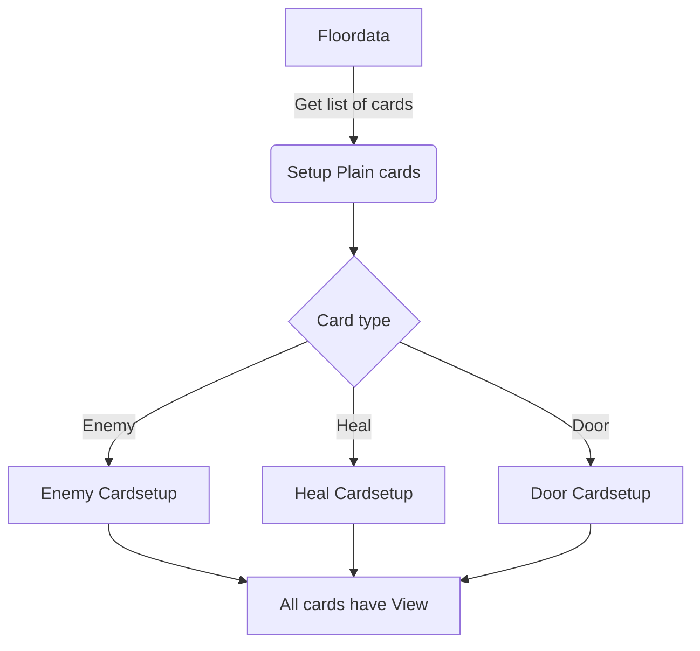

```mermaid
flowchart TD
    A[Floordata] -->|Get list of cards| B(Setup Plain cards)
    B --> C{Card type}
    C -->|Enemy| D[Enemy Cardsetup]
    C -->|Heal| E[Heal Cardsetup]
    C -->|Door| F[Door Cardsetup]
    D --> G[All cards have View]
    E --> G
    F --> G
```
