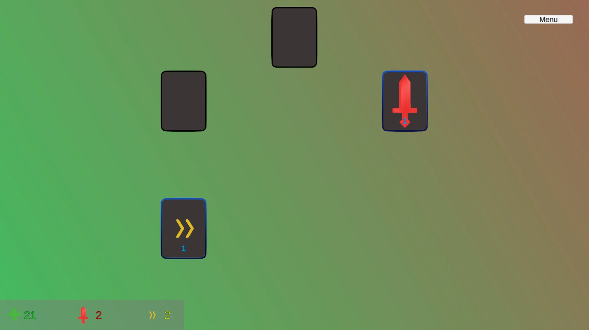
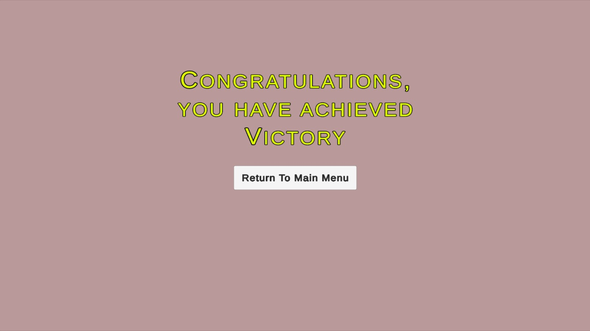
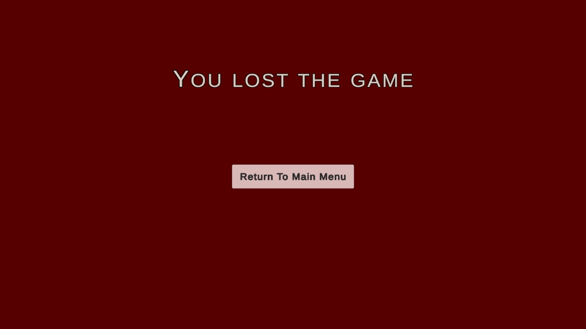
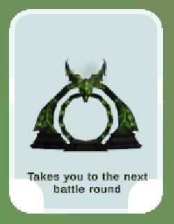

# Funkcionális specifikáció
## [Áttekintés](./kovspec.md)

## [Követelménylista](./kovspec.md#Követelménylista)

## Funkcionális követelmények
| Modul | Követelmény | ID | Név | Verzió | Kifejtés | DOD (Definition of Done) |
|:------|:------------|:---|:----|:-------|:---------|:-------------------------|
| Játékfelület | Kezdőmenü | F1.1 | Start gomb | 0.1 | Elindítja a játékot | Játék UI betölt |
|  |  | F1.2 | Quit gomb | 0.1 | Kilép az alkalmazásból | App bezár |
| Játékfelület | Játékmenü UI | F2.1 | Pause gomb | 0.1 | Megállítja a játékot | Pause menü megjelenik |
|  |  | F2.2 | Pause menü | 0.1 | Continue + Return gombok | Mindkettő működik |
|  |  | F2.3 | Statbar | 0.1 | HP/ATK/SPD kijelzése | Értékek frissülnek |
| Játék mechanika | Játékindítás és navigáció | F3.1 | Navigáció | 0.1 | Menü → játék váltás | Minden esetben működik |
| Kártyarendszer | Kártyák kezelése | F4.1 | Kártyagenerálás | 0.2 | Szinthez szükséges kártyák létrehozása | Helyes számú kártya jelenik meg |
|  |  | F4.2 | Felfordulás logika | 0.2 | Kártyák csak feltétellel fordulnak fel | Logika működik |
|  |  | F4.3 | Kattintási interakció | 0.2 | Csak felfordult kártya kattintható | Click esemény működik |
| Szintek | Szintek és nehézség | F5.1 | Door kártya | 0.2 | Szint végén jelenik meg | Door aktiválható |
|  |  | F5.2 | Következő szint betöltése | 0.2 | Door után új pálya indul | Szint betöltődik |
|  |  | F5.3 | Nehézség növelése | 0.2 | Erősebb enemy-k szintenként | Progresszió működik |
| Kártyatípusok | Kártyatípusok | F6.1 | Enemy | 0.2 | Harcot indít | Combat aktiválódik |
|  |  | F6.2 | Heal | 0.2 | HP növelése | HP nő + UI frissül |
|  |  | F6.3 | Stat-up | 0.2 | Stat bónusz adása | Stat nő + UI frissül |
|  |  | F6.4 | Door | 0.2 | Szint váltás | Átvált következő szintre |
| Játék mechanika | Hero rendszer | F7.1 | Kezdő statok | 0.4 | Hero alap statok beállítása | Statok helyesek |
|  |  | F7.2 | Statváltozás | 0.4 | Heal/Stat-up hatások alkalmazása | UI frissül |
| Játék mechanika | Action–Reaction rendszer | F8.1 | Heal reakció | 0.6 | HP növelése | HP nő és kijelző frissül |
|  |  | F8.2 | Stat-up reakció | 0.6 | Stat növelése típus alapján | Működik és látható |
|  |  | F8.3 | Enemy reakció | 0.6 | Harc indítása | Harcrendszer aktiválódik |
|  |  | F8.4 | UI frissítés | 0.6 | Reakció után statok frissülnek | UI minden esetben szinkronban van |
| Játék mechanika | Harcrendszer | F9.1 | Hero támadás | 0.6 | Sebzés enemy-re | Enemy HP csökken |
|  |  | F9.2 | Enemy visszatámadás | 0.6 | Sebzés hero-ra | Hero HP csökken |
|  |  | F9.3 | Harc lezárása | 0.6 | Enemy halál vagy hero halál | Következő logika aktiválódik |
| Játékfelület | Animációk | F10.1 | Harci animációk kattintásnál | 1.0 | Támadások vizualizálása | Animáció fut |
|  |  | F10.2 | Kártya felhasználás effekt | 1.0 | Becsúszás középre, majd eltűnés | Animáció fut |
| Játékfelület/ mechanika | Win/ Lose rendszerek | F11.1 | Win képernyő | 1.0 | Játék végén jelenik meg; Menübe visszalépés | Win UI, navigáció működik |
|  |  | F11.2 | Lose képernyő | 1.0 | Hero halálakor; Menübe visszalépés | Lose UI, navigáció működik |
| Játék mechanika | Plusz feature bővítések | F12.1 | Loot és Armor rendszer | 2.0 | Loot kártyák buffokkal; Armor stat; sebzéscsökkentés mechanika | Loot effektek működnek; armor befolyásolja az ellenség sebzését |
|  |  | F12.2 | Gazdasági rendszer (Currency + Shop) | 2.0 | Currency gyűjtés enemy legyőzésekor; Shop floor; vásárlási funkciók | Currency UI frissül; vásárlás levonja a megfelelő összeget |
|  |  | F12.3 | Státusz effektek | 2.0 | Burn, Poison és egyéb effektek működése, ikon megjelenítés | Effektek helyesen befolyásolják a harcot és UI-n jelölve vannak |

## Nemfunkcionális követemények
NFR1 - Megbízhatóság
- A rendszernek stabilan, összeomlás nélkül kell működnie, és hibák esetén biztosítania kell a visszatérést működő állapotba.

NFR2 - Teljesítmény
- A játék betöltési ideje nem haladhatja meg a meghatározott küszöböt (pl. 3–5 másodperc), és a játék közben stabil FPS-t kell tartania.

NFR3 - Használhatóság
- A felhasználói felületnek egyszerűnek, áttekinthetőnek és gyorsan megtanulhatónak kell lennie.

NFR4 - Karbantarthatóság
- A kódnak moduláris, jól dokumentált és könnyen bővíthető formában kell készülnie, hogy új funkciók gyorsan integrálhatók legyenek.

NFR5 - Kompatibilitás
- A rendszernek működnie kell a célplatformon (PC), és nem igényelhet speciális hardvert.

NFR6 - Bővíthetőség
- A játékrendszernek támogatnia kell új kártyák, szintek, ellenfelek vagy funkciók hozzáadását minimális módosítással.

NFR7 - Elérhetőség / Telepíthetőség
- A rendszernek könnyen telepíthetőnek vagy elérhetőnek kell lennie (pl. letölthető).

## Felülettervek
### Main Menu
A játékos ebben a menüben tudja elindítani a játékot (Start), vagy kilépni(Quit game).

### Hero chosing
A játékos itt tudja kiválasztani hogy melyik hőssel szeretne játszani.

### Combat Menu
Hősválasztás után ebben a menüben kezdődik el a játék, ahol betölt az első szint.

### Pause Menu
A játékot bármelyik pillanatban meg tudja állítani a játékos a Pause menu gombra kattintással, amivel feljön a Pause menu. Ebből folytathatja a jelenlegi játékot, vagy vissza tud lépni a Main menu-be és újat kezdeni (Return to menu).

### End of floor
Ha elpusztult minden kártya egy körben, akkor megjelenik a végén egy ajtó, amivel tovább lehet lépni a következő szintre.

### Special floor
A játék során random generálódnak speciális szintek, amelyek különböznek az alapból meghatározottaktól. Az egyiken heal-ek, a másikon statup kártyák vannak.

### Win game
Ha a játékos legyőzte az utolsó szinten az utolsó kártyát is, akkor ez a felület fog megjelenni.

### Lose game
A játék során ha a játékos életereje elfogy, elveszíti a játékot, és ez a felület jelenik meg.

### Enemy kártya
A játékos ez a kártyatípus ellen harcolni, ezeket kell legyőznie.

### Heal kártya
A játékos ezzel a kártyatípussal gyógyul.

### Stat-up kártya
A játékos ezzel a kártyatípussal valamelyik stat-ját fejleszti.

### Door kártya
A játékos erre a kártyatípusra kattintva lép a következő szintre.

