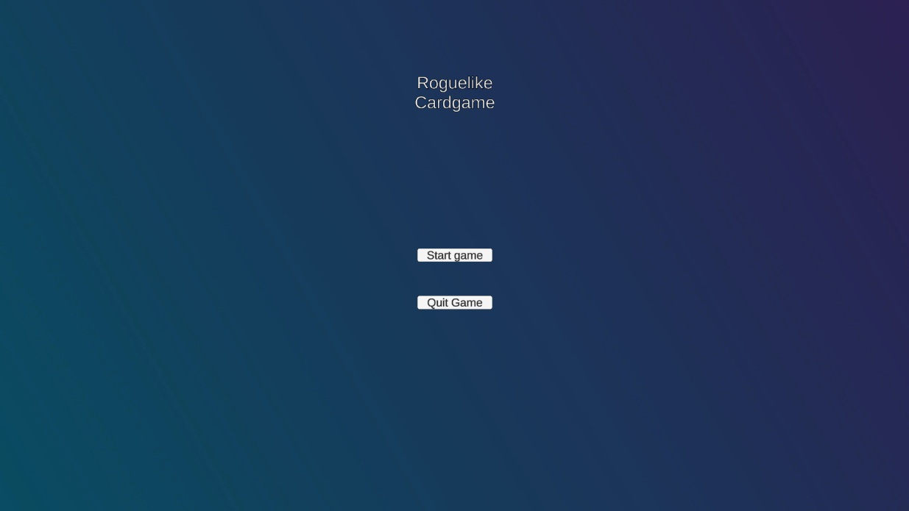
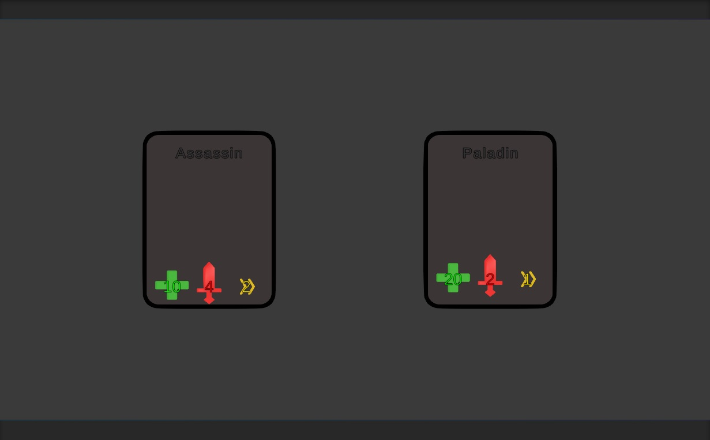
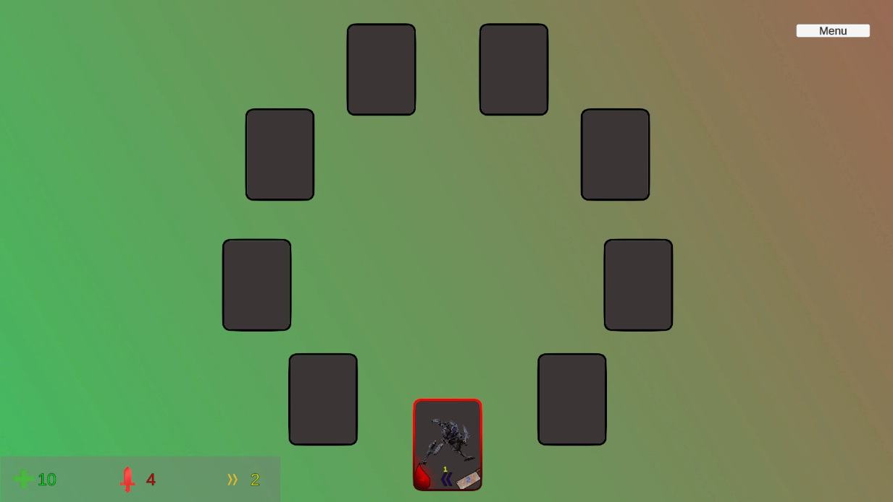
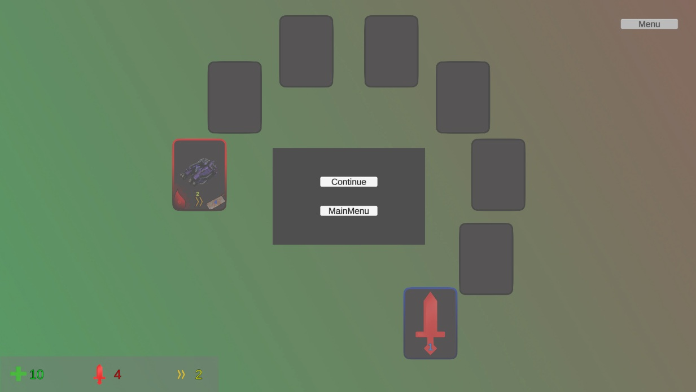
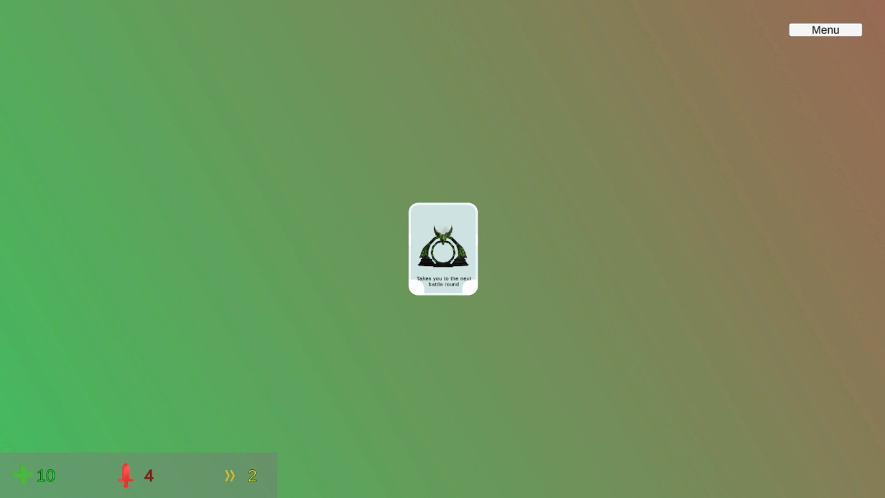
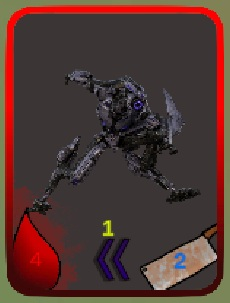
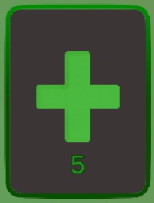
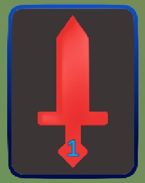

# Funkcionális specifikáció
## [Áttekintés](./kovspec.md)

## [Követelménylista](./kovspec.md#Követelménylista)

## Felülettervek
### Main Menu
A játékos ebben a menüben tudja elindítani a játékot (Start), vagy kilépni(Quit game).

### Hero chosing
A játékos itt tudja kiválasztani hogy melyik hőssel szeretne játszani.

### Combat Menu
Hősválasztás után ebben a menüben kezdődik el a játék, ahol betölt az első szint.

### Pause Menu
A játékot bármelyik pillanatban meg tudja állítani a játékos a Pause menu gombra kattintással, amivel feljön a Pause menu. Ebből folytathatja a jelenlegi játékot, vagy vissza tud lépni a Main menu-be és újat kezdeni (Return to menu).

### End of floor
Ha elpusztult minden kártya egy körben, akkor megjelenik a végén egy ajtó, amivel tovább lehet lépni a következő szintre.

### Special floor
A játék során random generálódnak speciális szintek, amelyek különböznek az alapból meghatározottaktól.

### Win game
Ha a játékos legyőzte az utolsó szinten az utolsó kártyát is, akkor ez a felület fog megjelenni.

### Lose game
A játék során ha a játékos életereje elfogy, elveszíti a játékot, és ez a felület jelenik meg.

### Enemy kártya
A játékos ez a kártyatípus ellen harcolni, ezeket kell legyőznie.

### Heal kártya
A játékos ezzel a kártyatípussal gyógyul.

### Stat-up kártya
A játékos ezzel a kártyatípussal valamelyik stat-ját fejleszti.

