# Rendszerterv

## Projektterv

### Csapattagok
- Ujj Ádám: Tervező és programozó
- Varga Szabolcs: Designer és programozó
- Dobi Fanni: Tesztelő és programozó

### Szerepkörök

- Tervező: A projekt szakmai és fejlesztési irányvonalának meghatározásáért felelős. Feladata a dokumentációk vezetése, a fejlesztési folyamatok nyomon követése és a Trello-feladatkezelő rendszer karbantartása. A Tervező hozza létre és osztja ki a feladatokat a csapattagok számára, valamint fejlesztői szerepet is ellát, kódot ír és részt vesz a program funkcionalitásának kialakításában.
- Tesztelő: A program működésének ellenőrzéséért és minőségbiztosításáért felelős. Feladata a unit tesztek megírása, futtatása és a teszteredmények dokumentálása. Gondoskodik arról, hogy a kód megfeleljen a tervezett követelményeknek, és segíti a hibák feltárását és javítását a fejlesztési folyamat során.
- Designer: A projekt vizuális megjelenítéséért felelős. Feladata a felhasználói felület és a játékelemek grafikai megtervezése, valamint a vizuális elemek integrálása a Unity környezetbe. A Designer biztosítja a játék esztétikailag egységes és felhasználóbarát megjelenését.

### Ütemterv és mérföldkövek
#### Sprint 1 – Fejlesztés
- Játék alapstruktúrájának kialakítása: kártyák és főmenü
- Backend: Unity mappa struktúra létrehozása és addonok telepítése
#### Sprint 2 – Fejlesztés
- Játékbeli kártya megjelenítése
- Főmenüből játékmenet indítása
- Játékmenetben Pause menü és gombjai, ezek funkcionálása
- Mérföldkő: a játék és főmenü közötti szabadon lépkedés
#### Sprint 3 – Fejlesztés
- Kártya kattintás
- Kör struktúrája
- Kártya instantiate
- Kártya speed stat
#### Sprint 4 – Fejlesztés
- sima card létrehozása, abból származtatni a kártyatípusokat (enemy, loot, heal, door)
- SRP: kódot kisebb részekre bontani
- kártya spawnt randomizálni floor-onként
#### Sprint 5 – Fejlesztés
- Fix 5 különböző floor kialakítása
- Stat-up kártya hozzáadása
- Door, Heal kártya reakció
#### Sprint 6 – Fejlesztés
- Action-Reaction system kialakítása
- Floor-on belül randomizálás
- Speciális floor

## Fizikai környezet
Fizikai környezet alapján a rendszer bontható két részre.
### Backend
A backend a játék logikai és rendszeroldali rétege, amely biztosítja az egyes rendszerek (pl. kártyakezelő, játékos-statisztikák, mentési rendszer, event manager) működését. Ez a rész C# nyelven, önálló Unity-scriptek és komponensek formájában valósul meg, egységekbe rendezve az adott funkciók szerint (pl. külön szkriptek a kártyák logikájához, a pontszámítási rendszerhez vagy a játékállapot-kezeléshez). A rendszeradatokat lokális szinten, ScriptableObjectekben vagy JSON alapú tárolókban kezeljük, így nincs szükség külön szerverre vagy külső adatbázisra. A moduláris felépítés lehetővé teszi, hogy új funkciókat vagy addonokat külön komponensként építsünk be anélkül, hogy a meglévő rendszert módosítanunk kellene.
### Frontend
A frontend a játék vizuális és interaktív felülete, amelyet a Unity motor jelenít meg. Ide tartozik a főmenü, a játékmező, valamint a kártyák és UI-elemek kezelése. A Unity UI-rendszerét (UGUI) használjuk a felhasználói felület elemeinek megjelenítésére és kezelésére, az animációkhoz pedig a Unity Animation vagy DOTween megoldásokat alkalmazzuk. A frontend és a backend szorosan együttműködik: a backend szolgáltatja a szükséges adatokat és logikát, míg a frontend ezeket látványosan, játékosbarát módon jeleníti meg.

## Funkcionális terv

Rendszerszereplők:

- játékos

Használati esetek és lefutásaik:

- játékos főmenüben elindítja a játékmenetet
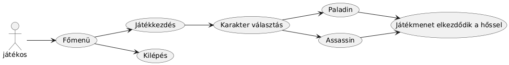
- játékos megállítja a játékot majd folytatja
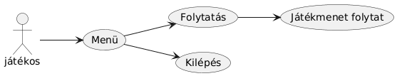
- játékos megállítja a játékot majd kilép a főmenübe

- játékos harcol egy ellenség kártyával és győz
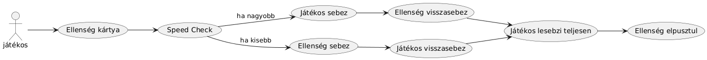
- játékos harcol egy ellenség kártyával és veszít
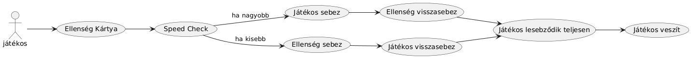
- játékos gyógyít egy gyógyítás kártyával
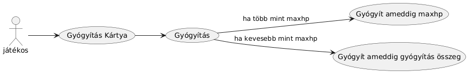
- játékos fejleszt egy fejlesztés kártyával
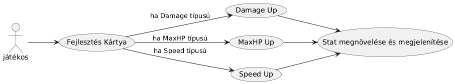
- játékos végigviszi a szintet és továbbmegy egy ajtó kártyával
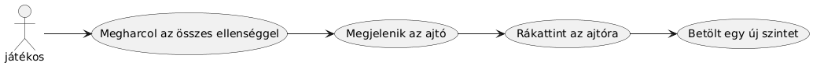
- játékos ajtó kártyával speciális szintre jut
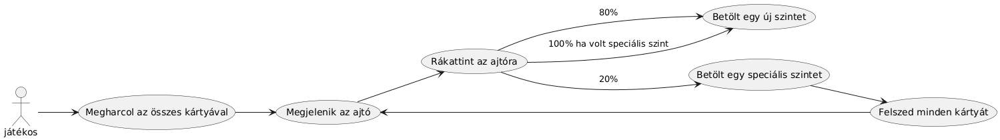
- játékos végigvitte a játékot és nyert
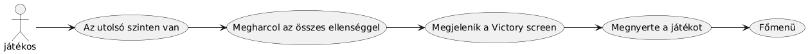

## Architekturális terv
### Frontend
Az alábbi fő komponensekből épül fel:
- UI: Ide tartozik a főmenü amiből kiválasztjuk hogy milyen hős szeretnénk lenni és az betöltődik a játékmenetbe
- Kártya: Ide tartozik az összes kártya típus amely az adatból betölti a view részt a játékmenetbe
- Game UI: Ez a fő megjelenített része a játéknak, ebbe van a Hős és a Kártyák view része, itt történik a játékmenet
- Backend: A játékmenetben történő funkciók a Backend részen vannak lekezelve

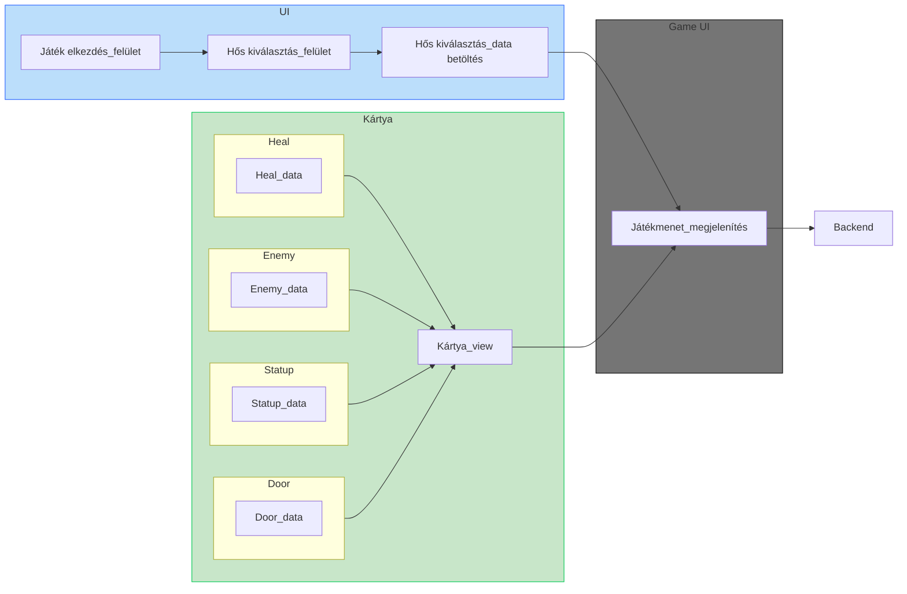
### Backend
Az architektúra fő elemei a következők:
- UnityEditor: A különféle adatokat itt lehet létrehozni és megadni a tulajdonságaikat
- Data: A kártyák és hősök első része, ez tartalmazza azt az adatot ami indulásnál betöltődik és képzeünk belőle egy model-t és egy view-t
- Model: A kártyák és hősök második része, ez tartalmazza azt az adatot ami a létrehozott hős vagy kártyákra egyedire vonatkozik így ha változás éri játékmenetben csak az adott kártyára vagy hősre fog vonatkozni nem pedig az összesre
- View: A kártyák és hősök harmadik része, ez tartalmazza az adatból megjelenített részeket, minden ami látszódik a játékban az egy adott modellnek a view része

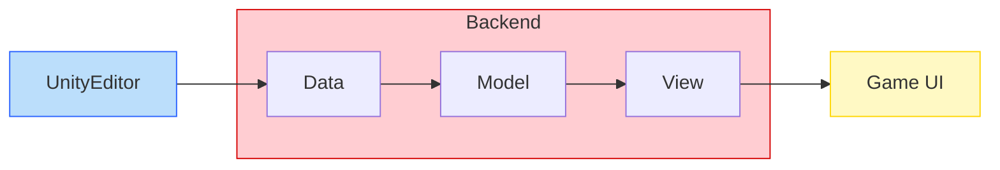

## Üzleti folyamatok modellje

## [Tesztterv](./tesztterv.md)

